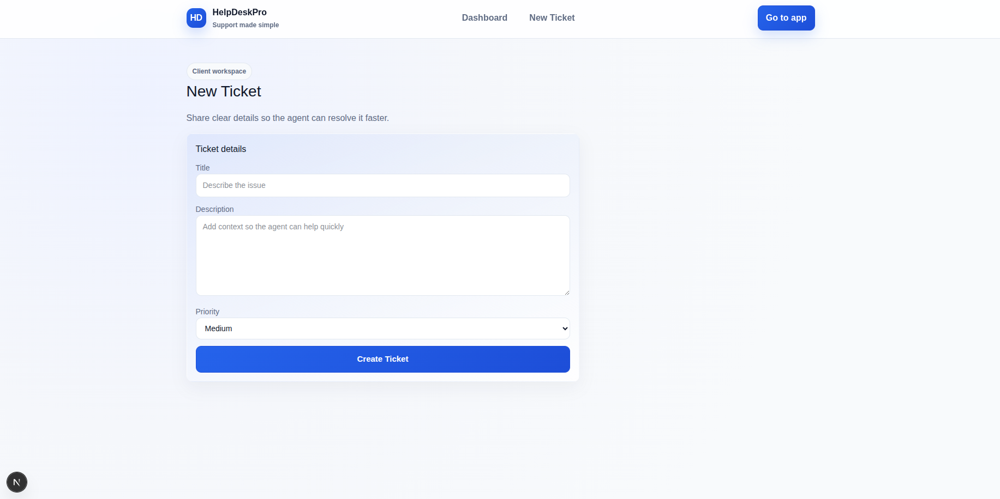

# HelpDeskPro (Next.js App Router)

Full-stack helpdesk/ticketing app built with Next.js 16 (App Router), TypeScript, MongoDB/Mongoose, NextAuth (Credentials + JWT), Axios, and a lightweight UI kit (Button/Badge/Card + Toastify notifications).

## Features
- Ticket lifecycle: create, list/filter, update status/priority, assign agents, close.
- Comments: threaded comments by clients and agents, ordered chronologically.
- Roles: client, agent, admin. Middleware enforces access; admin can promote/demote roles.
- Auth: NextAuth Credentials (JWT sessions), protected dashboards, role-aware redirects.
- Emails: ticket created, agent reply, ticket closed; reminder cron for stale tickets.
- Cron: `/api/cron/reminders` scans tickets without agent replies (24h) and emails assigned agents.
- UI: reusable components, badges for status/priority, grids for tickets, toasts for feedback.

## Tech stack
- Next.js 16+ (App Router) with `/src` structure
- TypeScript strict mode
- MongoDB + Mongoose
- NextAuth.js Credentials Provider (JWT sessions)
- Axios for client API calls
- React Context for session/ticket state
- Toasts via `react-toastify`

## Quick start
1) Install dependencies
```bash
npm install
```

2) Environment variables (`.env.local`)
```bash
MONGODB_URI=mongodb+srv://<user>:<pass>@<cluster>/<db>
NEXTAUTH_URL=http://localhost:3000
NEXTAUTH_SECRET=your-random-secret
EMAIL_HOST=smtp.yourprovider.com
EMAIL_PORT=587
EMAIL_USER=your-user
EMAIL_PASS=your-pass-or-app-password
EMAIL_FROM="HelpDeskPro <no-reply@yourdomain.com>"
CRON_SECRET=replace-with-strong-secret
```

3) Run the dev server
```bash
npm run dev
```
Open http://localhost:3000. You’ll be redirected to `/login` if not authenticated.

4) Run tests (Jest + React Testing Library)
```bash
npm test
```

## Auth and roles
- Register a client user via `POST /api/auth/register` or the `/register` page.
- Login at `/login` (NextAuth Credentials).
- Admin can promote/demote roles from `/dashboard/admin` (client/agent/admin).
- Middleware protects `/dashboard/*` and `/tickets/*` and redirects to the right panel per role.

## API overview (JSON shape: `{ ok, data?, error? }`)
- `POST /api/auth/register` – create user (default client)
- `GET /api/users` – agent/admin (agents get agents; admins get everyone)
- `PATCH /api/users/:id` – admin only, update role
- `POST /api/tickets` – client creates ticket
- `GET /api/tickets` – agent/admin see all; client sees own; supports status/priority filters
- `GET /api/tickets/:id` – view ticket with role check
- `PATCH /api/tickets/:id` – agent/admin: status/priority/assignedTo/title/description; client: title/description if open
- `DELETE /api/tickets/:id` – agent/admin
- `POST /api/tickets/:id/comments` – add comment (client/agent/admin)
- `GET /api/tickets/:id/comments` – list comments (role-aware)
- `GET /api/cron/reminders` – cron endpoint to remind agents of stale tickets (header `x-cron-secret` must match `CRON_SECRET` when set)

## UI pages
- `/login`, `/register` – auth screens
- `/dashboard` – redirects by role
- `/dashboard/client` – client tickets + filters, create CTA
- `/dashboard/agent` – all tickets, filters, inline status/priority/assign edits
- `/dashboard/admin` – user/role management
- `/tickets/new` – client ticket creation
- `/tickets/[id]` – ticket details, status/priority/assignment (agent/admin), text edits (client when open), comments

## Emails
- Ticket created → client
- Agent comment → client
- Ticket closed → client
- Cron reminder → assigned agent when no agent reply in 24h
Uses nodemailer; if SMTP is not configured, it falls back to JSON transport (logs).

## Cron example
Call the reminder endpoint hourly (with secret):
```bash
0 * * * * curl -s -H "x-cron-secret:${CRON_SECRET}" https://your-app.vercel.app/api/cron/reminders
```

## Author
- Name: Roxana Naranjo Estrada
- Email: roxananaranjoestrada@gmail.com
- ID: cc1001362259

## Screenshots 



# Next.js-performance-test
# Next.js-performance-test
